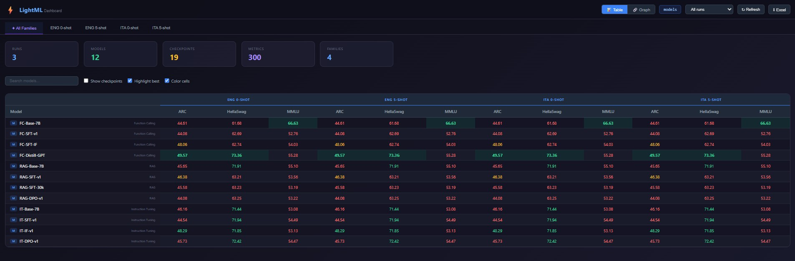
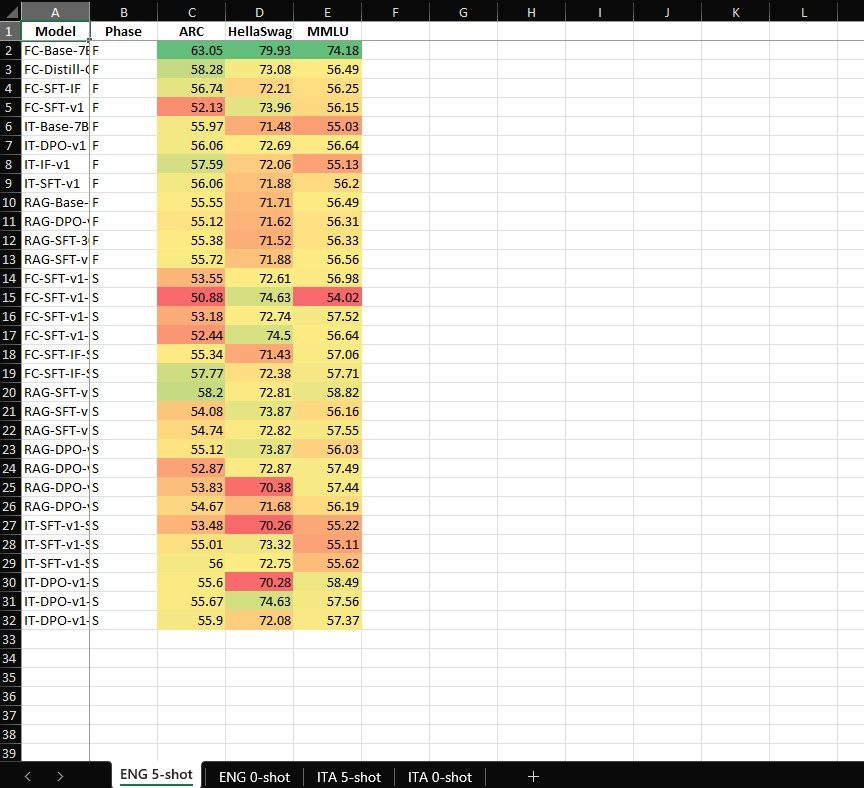
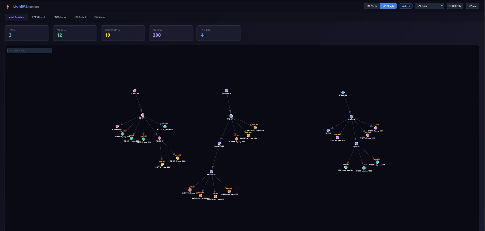
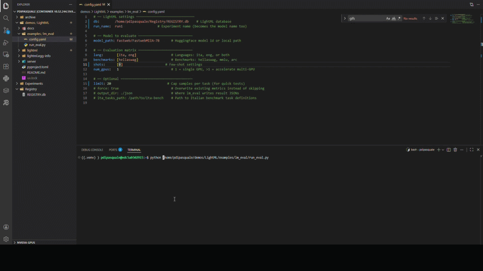

# ⚡ LightML

**Lightweight experiment tracking for LLM evaluation.**

LightML is a zero-config, SQLite-backed registry for tracking models, checkpoints, and metrics across evaluation runs. No servers to deploy, no MLflow overhead — just a single `.db` file that becomes your source of truth.

```
pip install light-ml-registry
lightml init --path ./my_registry --name main
```


<!-- GIF: open the dashboard, show the table view with models + metrics, click a few column headers to sort -->

---

## Table of Contents

- [Why LightML](#why-lightml)
- [Installation](#installation)
- [Quick Start (5 minutes)](#quick-start-5-minutes)
  - [1. Create a registry](#1-create-a-registry)
  - [2. Register a model and log metrics](#2-register-a-model-and-log-metrics)
  - [3. View results](#3-view-results)
  - [4. Export to Excel](#4-export-to-excel)
- [Core Concepts](#core-concepts)
- [Python API Reference](#python-api-reference)
  - [LightMLHandle](#lightmlhandle)
  - [Bulk metric logging](#bulk-metric-logging)
  - [Metric deduplication](#metric-deduplication)
  - [Compare models](#compare-models)
  - [Auto-import (scan)](#auto-import-scan)
- [CLI Reference](#cli-reference)
- [Dashboard (GUI)](#dashboard-gui)
  - [Table View](#table-view)
  - [Graph View](#graph-view)
  - [Model Selection & Compare](#model-selection--compare)
  - [Excel Export](#excel-export-1)
- [Excel Export](#excel-export)
- [Walkthrough: lm_eval pipeline](#walkthrough-lm_eval-pipeline)
  - [Step 1 — Configure](#step-1--configure)
  - [Step 2 — Run evaluation](#step-2--run-evaluation)
  - [Step 3 — Explore in dashboard](#step-3--explore-in-dashboard)
  - [Step 4 — Export report](#step-4--export-report)
- [Database Schema](#database-schema)
- [Project Structure](#project-structure)

---

## Why LightML

| Feature | LightML | MLflow | W&B |
|---|---|---|---|
| Setup | `pip install light-ml-registry` | Server + DB | Cloud signup |
| Storage | Single SQLite file | Postgres/MySQL | Cloud |
| Dependencies | 4 packages | 20+ packages | API key required |
| Dashboard | Built-in (`lightml gui`) | Separate server | Web app |
| Excel export | Built-in | No | No |
| Offline | ✅ | Partially | ❌ |

LightML is ideal when you need structured experiment tracking without the infrastructure.

---

## Installation

### From PyPI (recommended)

```bash
pip install light-ml-registry
```

### From source (development)

```bash
git clone <repo-url> && cd LightML
pip install -e ".[dev]"
```

Dependencies (auto-installed):
- `pydantic` — schema validation
- `fastapi` + `uvicorn` — dashboard server
- `openpyxl` — Excel export

For the lm_eval example you also need:
```bash
pip install lm-eval pyyaml
```

---

## Quick Start (5 minutes)

### 1. Create a registry

```bash
lightml init --path ./my_registry --name main
```

This creates `./my_registry/main.db` with all required tables.

### 2. Register a model and log metrics

```python
from lightml.handle import LightMLHandle

# Connect to registry and create an experiment run
handle = LightMLHandle(db="./my_registry/main.db", run_name="gpt2-eval")

# Register the model
handle.register_model(
    model_name="gpt2-eval",
    path="openai-community/gpt2",
)

# Log metrics — family groups related metrics together
handle.log_model_metric(
    model_name="gpt2-eval",
    family="hellaswag_0shot",
    metric_name="hellaswag_acc",
    value=0.289,
)

handle.log_model_metric(
    model_name="gpt2-eval",
    family="hellaswag_0shot",
    metric_name="hellaswag_acc_norm",
    value=0.312,
)
```

### 3. View results

```bash
lightml gui --db ./my_registry/main.db --port 5050
```

Open `http://localhost:5050` in your browser.


<!-- GIF: run `lightml gui`, browser opens, show the table with gpt2-eval metrics -->

### 4. Export to Excel

```bash
lightml export --db ./my_registry/main.db --output report.xlsx
```

Generates one sheet per metric family with automatic color-scale formatting.

---

## Core Concepts

LightML organizes data around four entities:

```
Run (experiment)
 └── Model
      ├── Metrics (family / metric_name / value)
      └── Checkpoint (step N)
           └── Metrics
```

### Run
An experiment context. Every model belongs to a run. Runs are created automatically when you instantiate `LightMLHandle`.

### Model
A trained model registered under a run. Supports **parent-child lineage** to track fine-tuning chains (e.g., `base → SFT → DPO`).

### Checkpoint
An intermediate training snapshot linked to a model. Identified by step number.

### Metrics
Numeric values attached to either a model or a checkpoint. Organized by **family** (a logical group like `"hellaswag_0shot"`) and **metric_name** (like `"hellaswag_acc"`).

---

## Python API Reference

### LightMLHandle

The main entry point. All operations go through this handle.

```python
from lightml.handle import LightMLHandle

handle = LightMLHandle(db="path/to/registry.db", run_name="my-experiment")
```

#### `register_model(model_name, path, parent_name=None)`

Register a model in the current run. Idempotent — calling twice with the same name is safe.

```python
handle.register_model(
    model_name="llama-sft",
    path="/models/llama-3-8b-sft",
    parent_name="llama-base",  # optional: link to parent model
)
```

#### `register_checkpoint(model_name, step, path)`

Register a training checkpoint.

```python
ckpt_id = handle.register_checkpoint(
    model_name="llama-sft",
    step=5000,
    path="/checkpoints/llama-sft/step-5000",
)
```

#### `log_model_metric(model_name, family, metric_name, value, force=False)`

Log a metric on a model. Returns a status code.

```python
from lightml.metrics import METRIC_INSERTED, METRIC_UPDATED, METRIC_SKIPPED

rc = handle.log_model_metric(
    model_name="llama-sft",
    family="mmlu_5shot",
    metric_name="mmlu_acc",
    value=0.634,
    force=False,  # True = overwrite if exists
)

if rc == METRIC_INSERTED:  print("New metric logged")
if rc == METRIC_SKIPPED:   print("Already existed, skipped")
if rc == METRIC_UPDATED:   print("Overwritten (force=True)")
```

#### `log_checkpoint_metric(checkpoint_id, family, metric_name, value, force=False)`

Same as above, but attached to a checkpoint instead of a model.

```python
handle.log_checkpoint_metric(
    checkpoint_id=ckpt_id,
    family="hellaswag_0shot",
    metric_name="hellaswag_acc_norm",
    value=0.412,
)
```

### Bulk Metric Logging

Instead of calling `log_model_metric()` once per metric, use `log_metrics()` to log an entire evaluation result in one call:

```python
# Nested dict: {family: {metric_name: value}}
counts = handle.log_metrics("llama-sft", {
    "ENG 5-shot": {"MMLU": 56.2, "ARC": 48.7, "HellaSwag": 71.9},
    "ITA 0-shot": {"MMLU": 52.8, "HellaSwag": 62.1},
})

print(counts)  # {"inserted": 5, "updated": 0, "skipped": 0}
```

For a single family, use the flat variant:

```python
counts = handle.log_metrics_flat("llama-sft", {
    "MMLU": 56.2,
    "ARC": 48.7,
}, family="ENG 5-shot")
```

Both methods support `force=True` to overwrite existing metrics, and return a summary dict with insert/update/skip counts.

### Compare Models

Compare two models side-by-side to see per-metric deltas:

```python
from lightml.compare import compare_models

result = compare_models(
    db="./registry/main.db",
    model_a="llama-base",      # baseline
    model_b="llama-sft",       # candidate
    run_name="my-experiment",  # optional filter
    family="ENG 5-shot",       # optional filter
)

# Convenience properties
print(f"Improved: {len(result.improved)}")
print(f"Regressed: {len(result.regressed)}")
print(f"Unchanged: {len(result.unchanged)}")
print(f"Missing: {len(result.missing)}")

# Pretty terminal output (color-coded)
print(result.to_text())

# JSON-serializable dict (for APIs)
data = result.to_dict()
```

Each delta contains `family`, `metric_name`, `value_a`, `value_b`, `delta` (B−A), and `pct_change`.

### Auto-import (Scan)

Bulk-import eval results from a directory tree without writing any Python:

```python
from lightml.scan import scan_and_import

stats = scan_and_import(
    db="./registry/main.db",
    run_name="lm-eval-run",
    path="./eval_results",         # each subfolder = one model
    format="lm_eval",              # or "json"
    model_prefix="eval/",          # optional prefix
    force=False,                   # True = overwrite duplicates
)

print(f"Models: {stats.models_registered}")
print(f"Metrics: {stats.metrics_logged}")
print(f"Skipped: {stats.skipped_dirs}")
```

**Directory layout expected:**
```
eval_results/
├── model-alpha/
│   └── results_2026-01-15T10-30-00.json   # lm_eval format
├── model-beta/
│   └── results_2026-01-16T09-00-00.json
└── model-gamma/
│   └── metrics.json                        # generic JSON format
```

**Supported formats:**
| Format | File pattern | Structure |
|---|---|---|
| `lm_eval` | `results_*.json` | `{"results": {"task": {"metric": value}}}` |
| `json` | `metrics*.json` / `*.json` | `{"metric": value}` or `{"family": {"metric": value}}` |

### Metric Deduplication

LightML prevents accidental duplicate metrics:

| Scenario | `force=False` (default) | `force=True` |
|---|---|---|
| Metric does not exist | INSERT → `METRIC_INSERTED` | INSERT → `METRIC_INSERTED` |
| Metric already exists | SKIP → `METRIC_SKIPPED` | UPDATE → `METRIC_UPDATED` |

This means you can safely re-run evaluation scripts without polluting your database.

---

## CLI Reference

```
lightml <command> [options]
```

### `init` — Create a new registry

```bash
lightml init --path ./registry --name main [--overwrite]
```

### `model-register` — Register a model

```bash
lightml model-register \
    --db ./registry/main.db \
    --run my-experiment \
    --name llama-sft \
    --path /models/llama-sft \
    --parent llama-base          # optional
```

### `checkpoint-register` — Register a checkpoint

```bash
lightml checkpoint-register \
    --db ./registry/main.db \
    --run my-experiment \
    --model llama-sft \
    --step 5000 \
    --path /checkpoints/step-5000
```

### `metric-log` — Log a single metric

```bash
lightml metric-log \
    --db ./registry/main.db \
    --run my-experiment \
    --model llama-sft \
    --family mmlu_5shot \
    --metric mmlu_acc \
    --value 0.634 \
    --force                      # optional: overwrite
```

### `export` — Export Excel report

```bash
lightml export --db ./registry/main.db [--output report.xlsx]
```

### `scan` — Auto-import eval results

Scan a directory tree and bulk-import models + metrics:

```bash
lightml scan \
    --db ./registry/main.db \
    --run lm-eval-run \
    --path ./eval_results \
    --format lm_eval              # or "json"
    --prefix "eval/"              # optional model name prefix
    --force                       # optional: overwrite duplicates
```

Each immediate subdirectory of `--path` is treated as one model.

### `compare` — Compare two models

Print a side-by-side metric delta table:

```bash
lightml compare \
    --db ./registry/main.db \
    --model-a llama-base \
    --model-b llama-sft \
    --run my-experiment           # optional
    --family "ENG 5-shot"         # optional
```

Output:
```
  Compare: llama-base  vs  llama-sft
  Run: my-experiment
  ──────────────────────────────────────────────────────────────────────────
  Family             Metric              A          B          Δ        %
  ──────────────────────────────────────────────────────────────────────────
  ENG 5-shot         MMLU            52.10      56.20      +4.10    +7.9%
  ENG 5-shot         ARC             44.30      48.70      +4.40    +9.9%
  ENG 5-shot         HellaSwag       69.50      71.90      +2.40    +3.5%
  ──────────────────────────────────────────────────────────────────────────
  ✅ 3 improved  ❌ 0 regressed  ➖ 0 unchanged  ❓ 0 missing
```

### `gui` — Launch dashboard

```bash
lightml gui --db ./registry/main.db [--port 5050] [--host 0.0.0.0]
```

---

## Dashboard (GUI)

LightML ships with an interactive web dashboard — no external tools needed.

```bash
lightml gui --db ./registry/main.db
```

### Table View

Pivoted metrics table with:
- **Family tabs** — one tab per metric family, plus "All Families" (properly scoped — same metric name across different families shows distinct values)
- **Sorting** — click any column header
- **Search** — filter models by name
- **Color coding** — best values highlighted in green, worst in red
- **Checkpoints toggle** — show/hide checkpoint rows
- **Run filter** — dropdown to isolate a specific run
- **Model selection** — checkbox column for selecting models


<!-- GIF: switch between family tabs, sort columns, toggle checkpoints, filter by run -->

### Graph View

D3.js force-directed graph showing model lineage:
- **Nodes** = models, colored by run
- **Edges** = parent → child relationships
- **Checkpoints hidden by default** — toggle "Show checkpoints" in the control bar to reveal them
- **Hover** = tooltip with green/red dots showing which benchmarks have been evaluated
- **Search** — filter nodes by name, path, or run
- **Drag & zoom** — fully interactive


<!-- GIF: switch to Graph tab, hover over nodes to see tooltips with benchmark dots, drag nodes, zoom in/out -->

### Model Selection & Compare

Select models from either view and compare them side-by-side:

1. **Select**: click checkboxes in the table, or click nodes in the graph — selections sync across both views
2. **Selection bar**: appears at the top showing count and actions
3. **Filter table**: click "Filter table" to show only selected models
4. **Compare**: select exactly 2 models, click "Compare" → a modal shows per-metric deltas with color-coded improvements (green) and regressions (red)
5. **Clear**: reset selection in both views

### Excel Export

Click **⬇ Excel** in the header to download a formatted `.xlsx` report directly from the dashboard.

---

## Excel Export

The export engine creates professional Excel reports from the database:

- **One sheet per metric family** — keeps related metrics grouped
- **Automatic color scales** — red → yellow → green formatting on all metric columns
- **Frozen headers** — first row + model name column stay visible while scrolling
- **Models (Phase F)** and **Checkpoints (Phase S)** on the same sheet

```python
from pathlib import Path
from lightml.export import export_excel

export_excel(
    db_path=Path("./registry/main.db"),
    output_path=Path("./report.xlsx"),
)
```

Or via CLI:
```bash
lightml export --db ./registry/main.db --output report.xlsx
```

---

## Walkthrough: lm_eval Pipeline

This walkthrough shows how to use LightML with [lm-evaluation-harness](https://github.com/EleutherAI/lm-evaluation-harness) to evaluate an LLM and track results. The complete example is in [`examples/lm_eval/`](examples/lm_eval/).

### Step 1 — Configure

Edit [`examples/lm_eval/config.yaml`](examples/lm_eval/config.yaml):

```yaml
# ── LightML settings ──────────────────────────────
db:        ./my_registry/main.db
run_name:  llama-3-eval

# ── Model to evaluate ────────────────────────────
model_path: meta-llama/Llama-3-8B

# ── Evaluation matrix ────────────────────────────
lang:       [eng]
benchmarks: [hellaswag, mmlu]
shots:      [0, 5]
num_gpus:   1
```

Every field is explained inline. The key LightML fields are `db` (path to registry) and `run_name` (experiment name).


<!-- GIF: open config.yaml, edit db path and model_path, save -->

### Step 2 — Run evaluation

```bash
cd examples/lm_eval
python run_eval.py
```

The script does three things:
1. **Connects to LightML** and registers the model (2 lines of setup)
2. **Runs lm_eval** for each (benchmark × language × shots) combination
3. **Logs every metric** to the registry with `handle.log_model_metric()`

Here's the core LightML integration — it's just 4 API calls:

```python
from lightml.handle import LightMLHandle

# Setup — 2 lines
handle = LightMLHandle(db=cfg["db"], run_name=cfg["run_name"])
handle.register_model(model_name=cfg["run_name"], path=cfg["model_path"])

# After each benchmark completes — 1 call per metric
handle.log_model_metric(
    model_name=handle.run_name,
    family="eng_hellaswag_0shot",
    metric_name="hellaswag_acc",
    value=0.452,
)
```


<!-- GIF: terminal running `python run_eval.py`, show the output with benchmark progress and "✓ logged" messages -->

### Step 3 — Explore in dashboard

```bash
lightml gui --db ./my_registry/main.db
```

### Step 4 — Export report

Click **⬇ Excel** in the dashboard header, or:

```bash
lightml export --db ./my_registry/main.db
```

---

## Database Schema

LightML uses a single SQLite file with 5 tables:

```sql
-- Experiment container
CREATE TABLE run (
    id          INTEGER PRIMARY KEY AUTOINCREMENT,
    run_name    TEXT UNIQUE NOT NULL,
    description TEXT,
    metadata    TEXT  -- JSON blob
);

-- Trained model, scoped to a run
CREATE TABLE model (
    id          INTEGER PRIMARY KEY AUTOINCREMENT,
    model_name  TEXT NOT NULL,
    path        TEXT,
    parent_id   INTEGER REFERENCES model(id),
    run_id      INTEGER NOT NULL REFERENCES run(id),
    UNIQUE(model_name, run_id)
);

-- Training checkpoint, linked to a model
CREATE TABLE checkpoint (
    id          INTEGER PRIMARY KEY AUTOINCREMENT,
    model_id    INTEGER NOT NULL REFERENCES model(id),
    step        INTEGER NOT NULL,
    path        TEXT,
    created_at  TEXT DEFAULT (datetime('now'))
);

-- Metric value, linked to a model OR a checkpoint
CREATE TABLE metrics (
    id              INTEGER PRIMARY KEY AUTOINCREMENT,
    model_id        INTEGER REFERENCES model(id),
    checkpoint_id   INTEGER REFERENCES checkpoint(id),
    family          TEXT NOT NULL,
    metric_name     TEXT NOT NULL,
    value           REAL NOT NULL
);

-- Optional: restrict allowed metrics
CREATE TABLE registry_schema (
    id          INTEGER PRIMARY KEY AUTOINCREMENT,
    family      TEXT NOT NULL,
    metric_name TEXT NOT NULL
);
```

---

## Project Structure

```
LightML/
├── pyproject.toml              # Package config, CLI entry point
├── README.md                   # This file
│
├── lightml/                    # Library source
│   ├── __init__.py
│   ├── handle.py               # LightMLHandle — main API (incl. bulk log_metrics)
│   ├── registry.py             # Run & model registration logic
│   ├── checkpoints.py          # Checkpoint registration
│   ├── metrics.py              # Metric logging + deduplication
│   ├── database.py             # SQLite schema initialization
│   ├── export.py               # Excel export engine
│   ├── compare.py              # Model comparison (Pydantic models + compare_models)
│   ├── scan.py                 # Auto-import from eval result directories
│   ├── gui.py                  # FastAPI dashboard server + /api/compare
│   ├── cli.py                  # CLI entry point (lightml command)
│   ├── models/                 # Pydantic schemas
│   ├── templates/
│   │   └── dashboard.html      # Single-file SPA dashboard
│   └── tests/
│       ├── test_bugfix.py       # Core regression tests (41 tests)
│       ├── test_compare.py      # Compare feature tests (15 tests)
│       ├── test_scan.py         # Scan / auto-import tests (17 tests)
│       ├── test_bulk.py         # Bulk metric API tests (15 tests)
│       └── conftest.py          # Shared fixtures
│
├── examples/
│   └── lm_eval/                # End-to-end evaluation example
│       ├── run_eval.py          # lm_eval + LightML pipeline
│       └── config.yaml          # Example configuration
│
└── docs/
    └── gifs/                   # GIF recordings for README
```